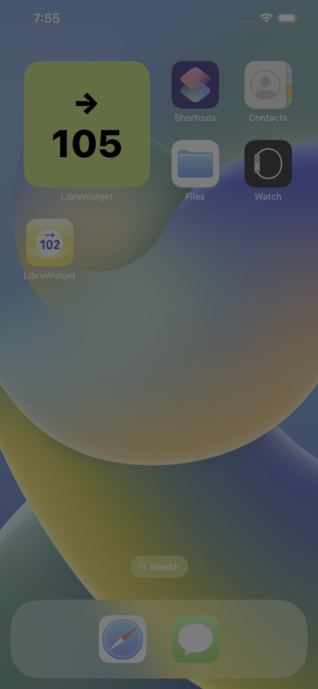

# LibreWidget

**Warning, This project is highly experimental. Please use this app with caution and extreme care. Do not make careless decisions based on software. Do not use this software if you are unsure.**

This is a fork of [stephan-james / LibreWidget](https://github.com/stephan-james/LibreWidget). Thank you for creating and sharing this app.

LibreWidget is an iOS application that extends the capabilities of the Libre Freestyle monitoring system with missing features.
Abbott did a good job with the Libre Freestyle 3, but unfortunately forgot some things on the UX side.
I had the expectation that my current glucose value would be displayed on the lock screen all of the time.
Unfortunately, this does not happen out-of-the-box.

This application makes all the difference.

Unfortunately, the application cannot be obtained from the AppStore because the API used is not public.
So you have to build your own local application.

## ToDo
- Watch complication
- Increase updates of widget
- indicate a timestamp of the value
- remove value if too old

## Testflight
I made a Testflight build. To try it out, install the App Testflight from the App Store and click on this link: [LibreWidget Testflight](https://testflight.apple.com/join/pGz2B7O7). Please provide feedback at librewidget@cmdline.net. Note that this is experimental software and I am doing this as a hobby out of personal interest (and I want my readings on the lock screen as well ;-)). Please forward to any xcoders you might know that have interest in this so maybe we can get some help with the development.

## LibreWidget Setup View
  

## LibreGlucoseWidget: System Small
 

## LibreGlucoseWidget: Accessory Circular
  
